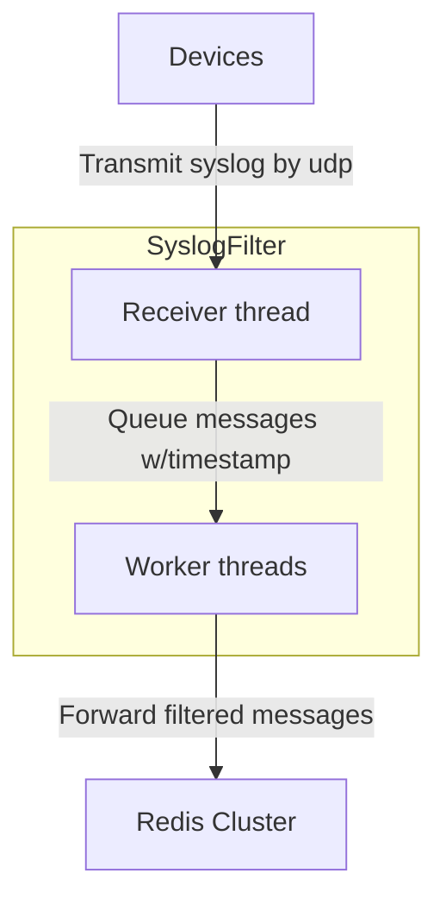
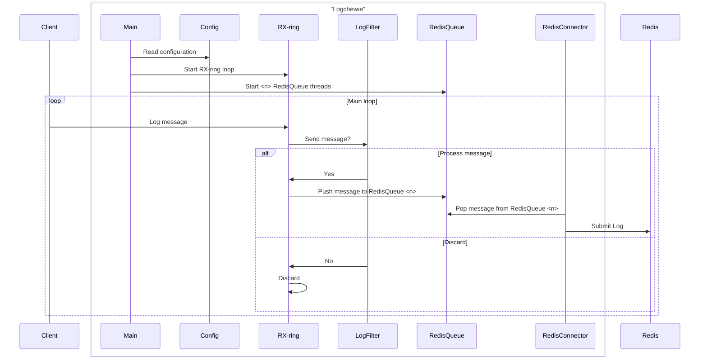
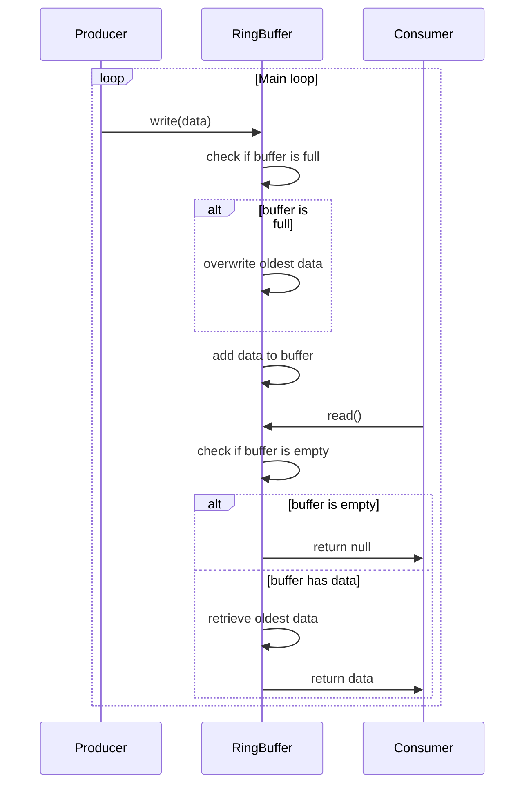

# **Logchewie** - REQUIREMENTS.md

## Overview

**Logchewie** is a high-performance application designed to handle large volumes of syslog messages received over UDP. The application filters incoming messages based on configured text patterns and priority/facility combinations, sending the relevant messages to specified Redis streams. The main goal of **Logchewie** is to ensure that only the most pertinent and relevant log information is processed and transmitted for further analysis.

## Problem Statement

Organizations rely on syslog messages to monitor and manage the health and status of systems, applications, and networks. However, processing high volumes of syslog data can become challenging, especially when only a subset of messages is of interest. **Logchewie** addresses this challenge by filtering syslog messages based on priority, facility, and specific text patterns, ensuring that only the most important information is processed and forwarded to Redis for further analysis. Text patterns can be used to allow or deny forwarding of a syslog message.

## Objectives

The main objectives of **Logchewie** are:

1. **Receive syslog messages**: The program must receive large volumes of syslog messages over UDP.
2. **Filter syslog messages**: The application will filter messages based on configurable priority, facility, and text patterns.
3. **Forward filtered messages**: Relevant messages will be sent to specific Redis streams for further processing or alerting.
4. **Redis Cluster Integration**: The application will seamlessly integrate with Redis to send filtered messages to specified streams.
5. **Concurrency with Event Loop and Threads**: The application must use an event loop to manage UDP message reception and support multiple worker threads for concurrent processing and forwarding.

## Design

**Logchewie** will operate according to the following steps:

1. **Receive Syslog Messages**: The application will receive syslog messages over a UDP socket. It should support high message rates without loss of messages.
2. **Filter Messages**: Syslog messages will be filtered based on configured priority/facility levels and matching text patterns.
3. **Redis Integration**: Filtered messages will be forwarded to Redis, categorized by Redis streams defined by the message's priority, facility, or content.
4. **Concurrent Processing**: The application will support multi-threaded processing, where each thread can receive and filter messages independently. This ensures scalability and performance when processing high volumes of messages.

## Application Requirements

1. **Programming Language**: **Logchewie** must be implemented in **C** due to its performance and ability to handle low-level network operations and concurrency efficiently.

2. **UDP Syslog Reception**:
   - Use raw sockets and [packet_mmap](https://docs.kernel.org/networking/packet_mmap.html) to receive high volume syslog messages over UDP. `packet_mmap` removes the need the copy of each packet from kernel-space to user-space.
   - Use of BPF filter on the socket to avoid irrelevant packets caused by using raw sockets.

3. **Message Filtering**:
   - Support filtering based on syslog priority (0-7) and facility (e.g., kernel messages, mail system, daemon messages).
   - Allow filtering based on configured text patterns (e.g., regular expressions and/or simple substring matching and/or a variant of b-tree).

4. **Redis Integration**:
   - Interface with Redis to send filtered syslog messages to specific Redis streams.
   - Use libraries like `hiredis` to connect and send messages to Redis.
   - Support Redis Cluster configurations for scalability and reliability.

5. **Concurrency and Event Loop**:
   - The application must utilize an event loop to handle the scheduling of message reception and processing.
   - Use libraries like `libuv` or `libev` in C for event-driven programming.
   - **Multi-threading support**: The application must support multiple worker threads, each running its own event loop to handle concurrent message processing and forwarding.

6. **Error Handling**:
   - Implement retry mechanisms for failed message forwarding to Redis.
   - Gracefully handle situations where the Redis cluster is unavailable or unresponsive.
   - Handle UDP socket errors and high traffic scenarios without dropping messages.

7. **Tests**:
   - **Unit tests**: Test message reception, filtering logic, and Redis forwarding.
   - **Integration tests**: Test the full end-to-end flow, including real syslog message reception, filtering, and Redis forwarding.
   - **Mock tests**: Simulate different network conditions, such as UDP packet loss or high traffic, and Redis availability issues.

8. **Documentation**:
   - The project must include comprehensive documentation to assist developers and users.
     - **Code Documentation**: Use in-code comments to explain key functions, modules, and classes.
     - **API Documentation**: Provide documentation for public interfaces, including message filtering and Redis forwarding functions.
     - **User Documentation**: Create a `README.md` with instructions on installation, configuration, and running the application.
     - **Developer Guide**: Provide a developer's guide outlining the architecture, how to contribute, run tests, and extend the system.
     - **Error Handling Documentation**: Document common errors and failure scenarios with potential solutions.
     - **Diagrams**: Supply diagrams to visually explain how **Logchewie** interacts with Redis, handles UDP message reception, and processes filtered messages.

## Directory Structure

The recommended directory structure for **Logchewie** is as follows:

```plaintext
**Logchewie**/
│
├── src/                # Source code
│   ├── main.c          # Main application logic
│   ├── config.h        # Configuration (priority, facility, patterns, Redis streams)
│   ├── udp.c           # UDP message reception
│   ├── filter.c        # Syslog message filtering logic
│   ├── redis.c         # Redis integration
│   └── utils/          # General utility functions
│
├── tests/              # Test cases
│   ├── test_udp.c      # Unit tests for UDP message reception
│   ├── test_filter.c   # Unit tests for message filtering
│   └── test_redis.c    # Unit tests for Redis forwarding
│
├── doc/                # Documentation
│   ├── REQUIREMENTS.md # This file
│   └── README.md       # User and Developer Guide
│
├── diagrams/           # Architecture and flow diagrams
│   ├── redis_flow.png
│
├── README.md           # Project overview and usage guide
└── Makefile            # Build and test automation
```

## Testing

1. **Unit Tests**:

   - Test the syslog message reception over UDP, ensuring messages are captured correctly.

   - Test the message filtering logic for various priority/facility and text pattern configurations.

   - Test Redis forwarding, ensuring filtered messages are sent to the correct streams.

2. **Integration Tests**:

    - Set up a Redis cluster and test the full flow: receiving syslog messages, filtering, and publishing relevant messages to Redis.
    - Simulate real-world syslog traffic to validate system performance and message throughput.

3. **Mock Testing**:

    - Use mocks to simulate high syslog message volumes, UDP packet loss, and Redis unavailability.
    - Test how the application handles network failures and system overload scenarios.

## Diagrams

Redis Flow and **Logchewie** Architecture



**Logchewie** sequence diagram



The diagram below presents the idea of ringbuffer usage.

